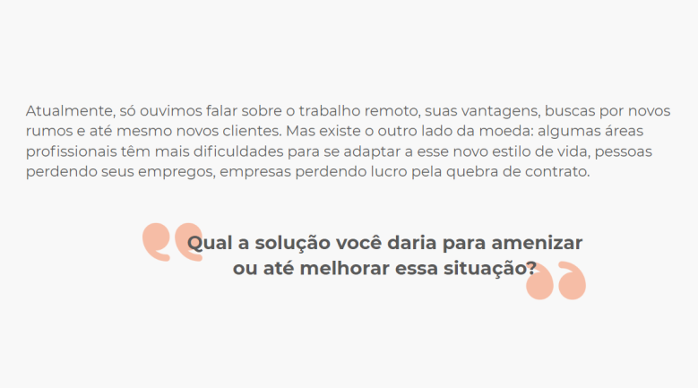

# Projeto FCamara
Repositorio para o frontend do projeto da SQUAD 10 para o programa de formação FCamara 2020. [Link para o backend](https://github.com/MatheusPalinkas/Projeto-FCamara-Backend)

Integrantes: [Matheus Palinkas](https://www.linkedin.com/in/matheus-palinkas/), 
             [Adriana Penha](https://www.linkedin.com/in/adriana-penha-598b12124/), 
             [Gusthavo Rodrigues](https://www.linkedin.com/in/gusthavo-rodrigues-487847197/)

# case 


# Nossa proposta de solução

Criar um Site/App (Responsivo), para poder ser um meio dos pequenos comércios (a maioria sem CNPJ) afetados pela pandemia, poder alcançar e vender os seus produtos (através da internet), para os seus clientes e possíveis consumidores.

# Pré-requisitos
 - [Node](https://nodejs.org/en/download/)
 - [Yarn](https://classic.yarnpkg.com/en/docs/install#debian-stable)

# Passo a passo

### 1. clonar o repositório
```
git clone https://github.com/MatheusPalinkas/Projeto-FCamara-Frontend.git
```
### 2. Acessar pasta e baixar dependências
```
cd frontend
yarn install
```
### 3. Alterar base url da api
Dentro da pasta frontend/src/services/Api.js. Alterar o valor da varivel baseURL.
```js
//Por default aponta para a API do projeto no heroku
const baseURL = `https://projeto-fcamara.herokuapp.com/`;
```
### 4. Iniciar aplicação
```
yarn start
```

# Outros links
[Link para arquivos no drive](https://drive.google.com/drive/folders/17vXJTFi-uhJ_oOf2tmRV0r_MPpUXcZnn?usp=sharing)

[Link para o wireframe no figma](https://www.figma.com/file/Z0HPB23kt7YKAJmQ3CTIPF/Aplicativo-lojas)

[Link para Style guide no Notion](https://www.notion.so/6ba0e075fc974b288320539b4a3b1159?v=81b413219a654ea0b877b789af22b06f)
